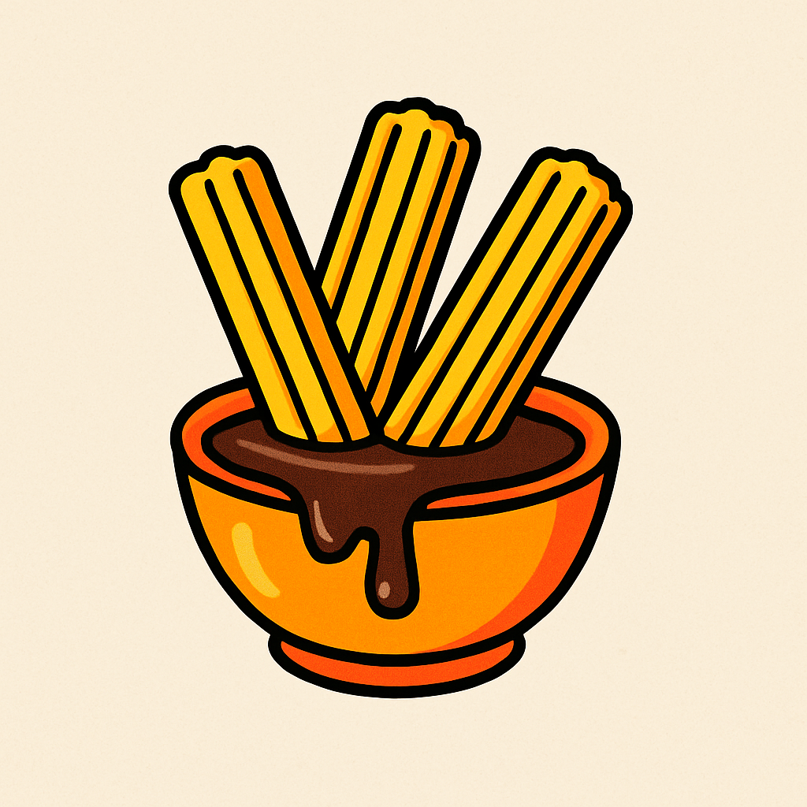
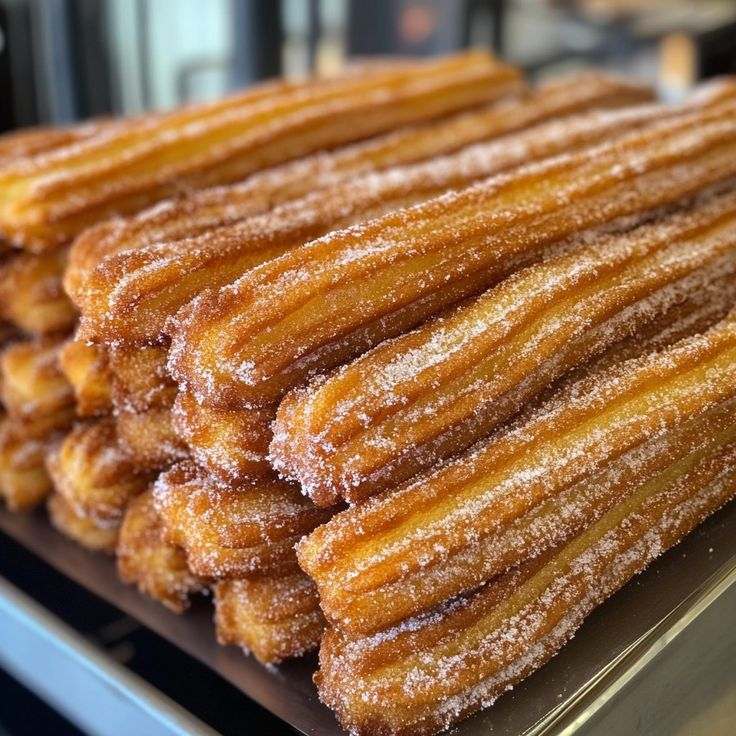

<html lang="en">
<head>
  <meta charset="UTF-8" />
  <meta name="viewport" content="width=device-width, initial-scale=1.0" />
  <title>Churroloco - Premium Churros</title>

  <!-- Tailwind CDN -->
  

  
</head>
<body>
  <!-- Navigation -->
  <nav class="bg-white shadow-sm sticky top-0 z-50">
    

      

      
ChurroLoco

      

        <a href="#product" class="font-medium hover:text-orange-500">Product</a>
        <a href="#location" class="font-medium hover:text-orange-500">Location</a>
      

      <!-- Mobile menu button -->
      <button id="menuButton" class="text-orange-500 md:hidden" aria-expanded="false" aria-controls="mobileMenu" aria-label="Toggle menu">
        <svg xmlns="http://www.w3.org/2000/svg" class="h-7 w-7" fill="none" viewBox="0 0 24 24" stroke="currentColor">
          <path stroke-linecap="round" stroke-linejoin="round" stroke-width="2" d="M4 6h16M4 12h16M4 18h16" />
        </svg>
      </button>
    

    <!-- Mobile menu panel (hidden by default) -->
    

      <a href="#product" class="block py-2 font-medium hover:text-orange-500">Product</a>
      <a href="#location" class="block py-2 font-medium hover:text-orange-500">Location</a>
    

  </nav>

  <!-- Hero Section -->
  <section class="hero-bg h-96 flex items-center justify-center text-white">
    

      <h1 class="text-4xl md:text-5xl font-bold mb-4">Churros</h1>
      
The spiral sensation taking Panabo by storm

    

  </section>

  <!-- Product Showcase -->
  <section id="product" class="py-16 bg-white">
    

      

        

          <!-- Use RELATIVE path + encode spaces if any -->
          
        

        

          <h2 class="text-3xl font-bold mb-4">Our Signature Churros</h2>
          
The revolutionary spiral-cut churro that maximizes crunch and flavor in every bite. Made fresh daily at our Panabo City Senior High School.

          

            <h3 class="text-xl font-semibold mb-3">Available Flavors</h3>
            

              Classic Cinnamon
              Chocolate Dip
              Cheese Supreme
            

          

          

            <h4 class="font-bold mb-2">What makes our Churros special:</h4>
            <ul class="list-disc pl-5 space-y-1">
              <li>Proprietary spiral cutting technique</li>
              <li>Premium cinnamon sugar blend</li>
              <li>Perfect crisp-to-soft ratio</li>
              <li>Made fresh in small batches</li>
            </ul>
          

        

      

    

  </section>

  <!-- Location Section -->
  <section id="location" class="py-16 bg-gray-50">
    

      <h2 class="text-3xl font-bold mb-6">Find Us At</h2>
      

        
Panabo City Senior High School

        
Where the Churro revolution began

      

    

  </section>

  <!-- Bottom Image -->
  <section class="bg-gray-100 py-2">
    

      <!-- If your filename has spaces, encode them as %20 -->
      
    

  </section>

  <!-- Footer -->
  <footer class="bg-orange-500 text-white py-8">
    

      
ChurroLoco

      
© 2025 Churroloco - Panabo City Senior High School

    

  </footer>

  
</body>
</html>
